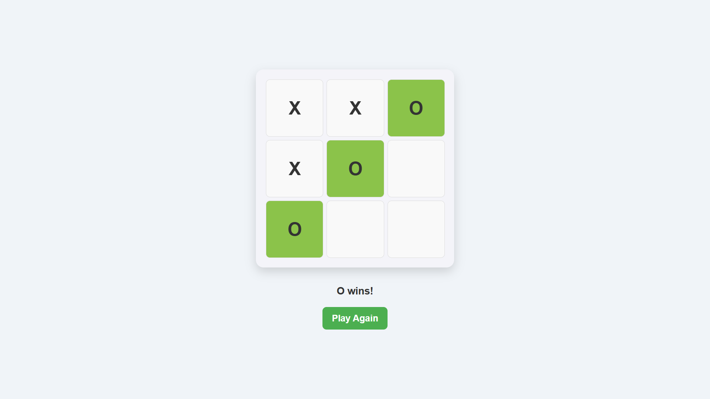
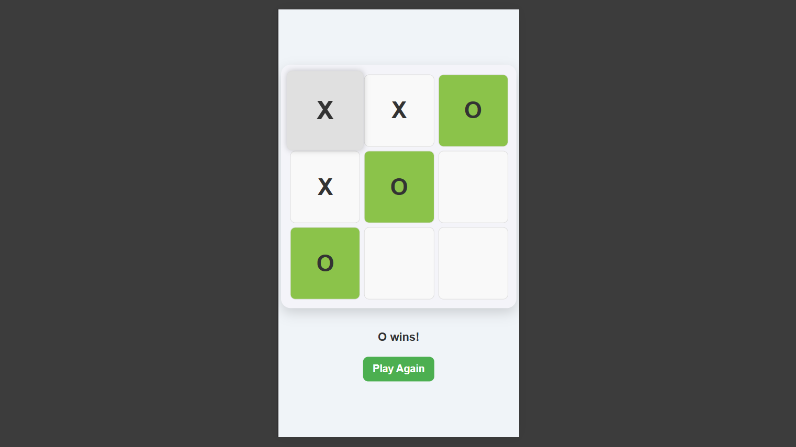

# Tic-Tac-Toe

> Simple browser-based Tic-Tac-Toe game built with HTML, CSS, and JavaScript.

[](https://developer.mozilla.org/docs/Web/HTML)
[](https://developer.mozilla.org/docs/Web/CSS)
[](https://developer.mozilla.org/docs/Web/JavaScript)

[](https://github.com/tauqxxr7/Tic-Tac-Toe)

## Problem

This project focuses on a classic browser game to demonstrate core frontend fundamentals like DOM updates, state handling, interaction logic, and responsive UI behavior.

## Solution

A lightweight Tic-Tac-Toe implementation with player-versus-computer gameplay, winner detection, draw handling, and a responsive layout that works on desktop and mobile.

## Features

- 3x3 game board
- Player vs computer gameplay
- Winner detection and draw handling
- Highlighted winning cells
- Restart button
- Responsive layout for desktop and mobile

## Tech Stack

- HTML
- CSS
- JavaScript

## Architecture

```text
User click -> DOM event -> game state update -> win/draw check -> UI render
```

## Project Structure

```text
Tic-Tac-Toe/
  index.html
  src/
    css/
      style.css
    js/
      script.js
    images/
      desktop.png
      mobile.png
```

## Setup

### 1. Clone the repository

```bash
git clone https://github.com/tauqxxr7/Tic-Tac-Toe.git
cd Tic-Tac-Toe
```

### 2. Run locally

Open `index.html` in your browser.

If you use VS Code, Live Server works well for local preview.

## Environment Variables

No environment variables are required for this project.

## Screenshots / Demo

### Desktop Preview



### Mobile Preview



## Live Demo

- Demo: `Deployment in progress`
- Source code: `https://github.com/tauqxxr7/Tic-Tac-Toe`

## Future Improvements

- Score tracking across rounds
- Difficulty levels for the computer opponent
- Better animations and feedback
- Theme variants

## Author

Built by **Tauqeer Bharde** as a frontend fundamentals project with clean interaction logic and responsive UI work.

## Recommended Repo Description

Classic Tic-Tac-Toe game built with HTML, CSS, and JavaScript.

## Suggested GitHub Topics

`javascript, game, html, css, beginner-project`
